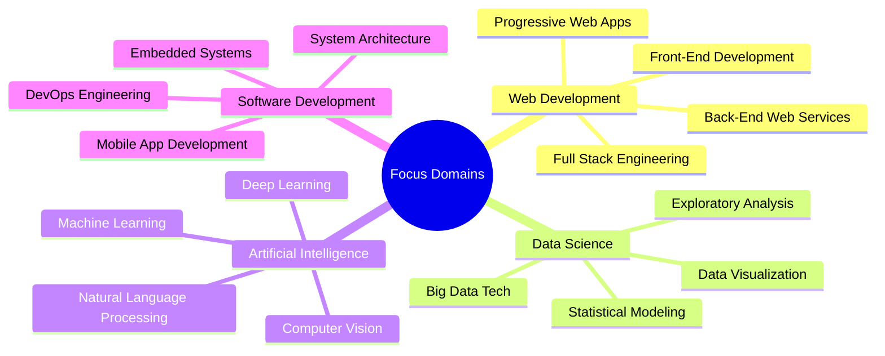

  

## About Me

Computer Science undergraduate with junior-level experience across AI/ML and full-stack
development. Comfortable moving between research-style work and shipping production-style web
applications.

**Current Focus:** Exploring AI-driven automation, cloud-native architectures, and software development.

  
  

 

## Strategic Development Areas

  

## Technical Toolkit

  
### Technology Stack

  

  

  

## GitHub Analytics

  

<table>
<tr>
<td align="center">
  
</td>
<td align="center">
  
</td>
<td align="center">
  
</td>
</tr>
</table>

---

